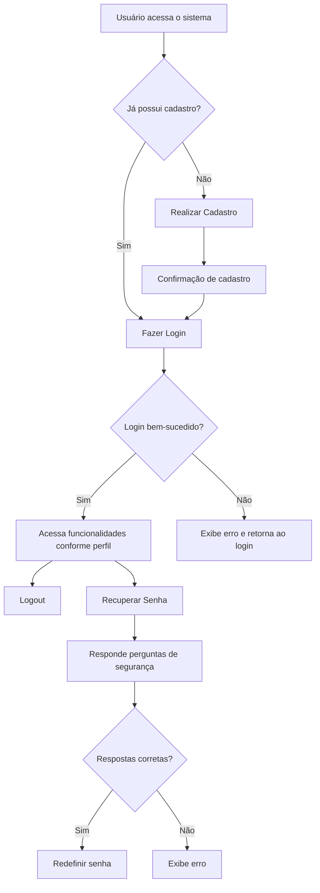

# Diagrama de Atividades

Este diagrama mostra o fluxo principal de uso do sistema, desde o acesso até o login, cadastro e recuperação de senha.

```mermaid
flowchart TD
  A["Usuário acessa o sistema"] --> B{"Já possui cadastro?"}
  B -- "Sim" --> C["Fazer Login"]
  B -- "Não" --> D["Realizar Cadastro"]
  C --> E{"Login bem-sucedido?"}
  E -- "Sim" --> F["Acessa funcionalidades conforme perfil"]
  E -- "Não" --> G["Exibe erro e retorna ao login"]
  D --> H["Confirmação de cadastro"]
  H --> C
  F --> I["Logout"]
  F --> J["Recuperar Senha"]
  J --> K["Responde perguntas de segurança"]
  K --> L{"Respostas corretas?"}
  L -- "Sim" --> M["Redefinir senha"]
  L -- "Não" --> N["Exibe erro"]
``` 