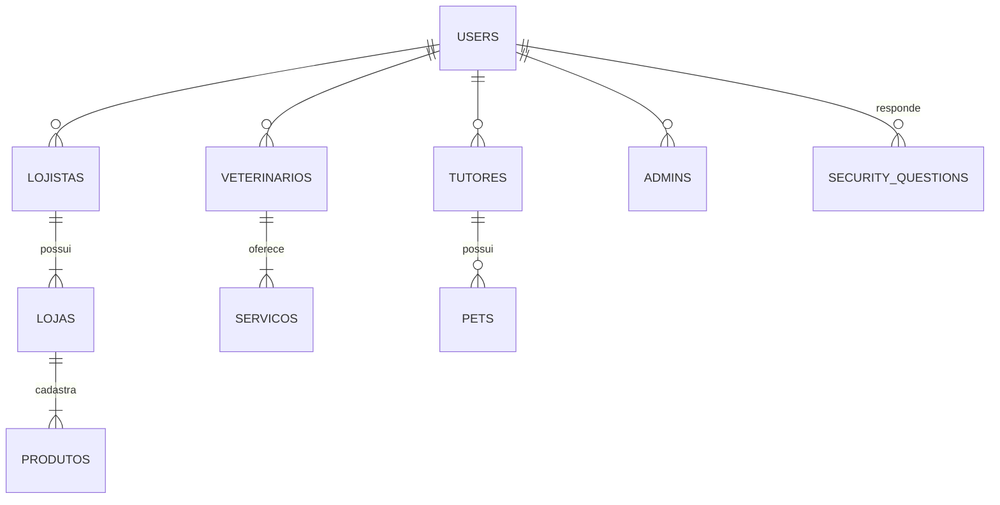

# Diagrama Entidade-Relacionamento (ERD)

Este diagrama mostra as entidades principais do sistema e seus relacionamentos.

```mermaid
erDiagram
  USERS ||--o{ LOJISTAS : ""
  USERS ||--o{ TUTORES : ""
  USERS ||--o{ VETERINARIOS : ""
  USERS ||--o{ ADMINS : ""
  LOJISTAS ||--|{ LOJAS : "possui"
  LOJAS ||--|{ PRODUTOS : "cadastra"
  VETERINARIOS ||--|{ SERVICOS : "oferece"
  TUTORES ||--o{ PETS : "possui"
  USERS ||--o{ SECURITY_QUESTIONS : "responde"
``` 