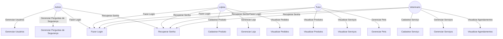

# Diagrama de Casos de Uso

Este diagrama mostra as principais interações dos atores com o sistema.

> **Nota:** O Mermaid não suporta nativamente usecase, então usamos graph TD para simular.

```mermaid
graph TD
  Admin((Admin))
  Lojista((Lojista))
  Tutor((Tutor))
  Veterinario((Veterinario))

  Admin -- Gerenciar Usuários --> GU[Gerenciar Usuários]
  Admin -- Gerenciar Perguntas de Segurança --> GPS[Gerenciar Perguntas de Segurança]
  Lojista -- Cadastrar Produto --> CP[Cadastrar Produto]
  Lojista -- Gerenciar Loja --> GL[Gerenciar Loja]
  Lojista -- Visualizar Pedidos --> VP[Visualizar Pedidos]
  Tutor -- Visualizar Produtos --> VPr[Visualizar Produtos]
  Tutor -- Visualizar Serviços --> VS[Visualizar Serviços]
  Tutor -- Gerenciar Pets --> GPets[Gerenciar Pets]
  Veterinario -- Cadastrar Serviço --> CS[Cadastrar Serviço]
  Veterinario -- Gerenciar Serviços --> GS[Gerenciar Serviços]
  Veterinario -- Visualizar Agendamentos --> VA[Visualizar Agendamentos]
  Admin -- Fazer Login --> FL[Fazer Login]
  Lojista -- Fazer Login --> FL
  Tutor -- Fazer Login --> FL
  Veterinario -- Fazer Login --> FL
  Admin -- Recuperar Senha --> RS[Recuperar Senha]
  Lojista -- Recuperar Senha --> RS
  Tutor -- Recuperar Senha --> RS
  Veterinario -- Recuperar Senha --> RS
``` 